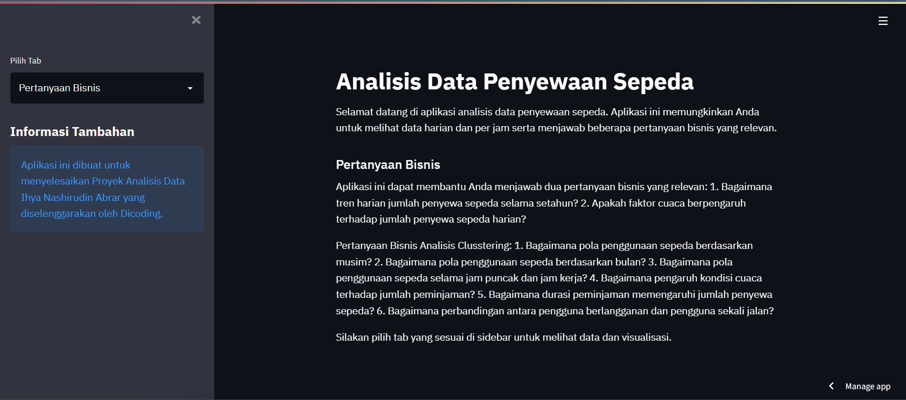

# Analisis Data Penyewaan Sepeda

Selamat datang di aplikasi analisis data penyewaan sepeda. Aplikasi ini memungkinkan Anda untuk menganalisis dan memvisualisasikan data penyewaan sepeda harian dan per jam.

## Deskripsi Proyek

Proyek ini bertujuan untuk menganalisis pola dan tren dalam penggunaan sepeda berdasarkan data harian dan per jam. Kami menggunakan dataset yang mencakup informasi tentang cuaca, jam, musim, dan faktor lain yang dapat memengaruhi jumlah penyewaan sepeda.

## Penggunaan Aplikasi

Anda dapat menjalankan aplikasi ini menggunakan Streamlit. Pastikan Anda telah menginstal semua dependensi yang diperlukan dengan menjalankan perintah berikut:

```bash
pip install -r requirements.txt
```
## Setelah itu, jalankan aplikasi dengan perintah:

```bash
streamlit run app.py
```
Aplikasi akan berjalan di browser Anda dan Anda dapat memilih tab yang sesuai untuk melihat data dan visualisasi.

## Struktur Proyek
app.py: Kode sumber aplikasi Streamlit.
day.csv: Data harian penyewaan sepeda.
hour.csv: Data per jam penyewaan sepeda.
requirements.txt: Berkas yang berisi daftar dependensi proyek.

## Pertanyaan Bisnis
Aplikasi ini dirancang untuk menjawab dua pertanyaan bisnis utama:

Bagaimana tren harian jumlah penyewa sepeda selama setahun?
Apakah faktor cuaca berpengaruh terhadap jumlah penyewa sepeda harian?
## Analisis Data
Aplikasi ini menyediakan analisis data yang mencakup:

Visualisasi distribusi jumlah peminjaman harian.
Perbandingan jumlah peminjaman antara hari libur dan bukan hari libur.
Pengaruh kondisi cuaca terhadap jumlah peminjaman.
Pola jam penggunaan sepeda dalam sehari.
Perbandingan penggunaan sepeda antara hari kerja dan hari libur.
Korelasi antara kecepatan angin, suhu, dan jumlah peminjaman.
Analisis pengelompokan berdasarkan musim, bulan, jam puncak, jam kerja, kondisi cuaca, durasi peminjaman, dan jenis pengguna.
## Kesimpulan
Hasil analisis data menunjukkan adanya hubungan antara suhu, cuaca, waktu, dan faktor lain dengan jumlah penyewaan sepeda. Informasi ini dapat digunakan untuk perencanaan dan pengelolaan penyewaan sepeda yang lebih efisien.

## Informasi Tambahan
Aplikasi ini dibuat sebagai bagian dari Proyek Analisis Data oleh Ihya' Nashirudin Abrar. Silakan hubungi kami jika Anda memiliki pertanyaan atau komentar.


## Streamlit Online
https://bike-sharing-dataset-4hj6nabxfefovr4dwondc8.streamlit.app/




